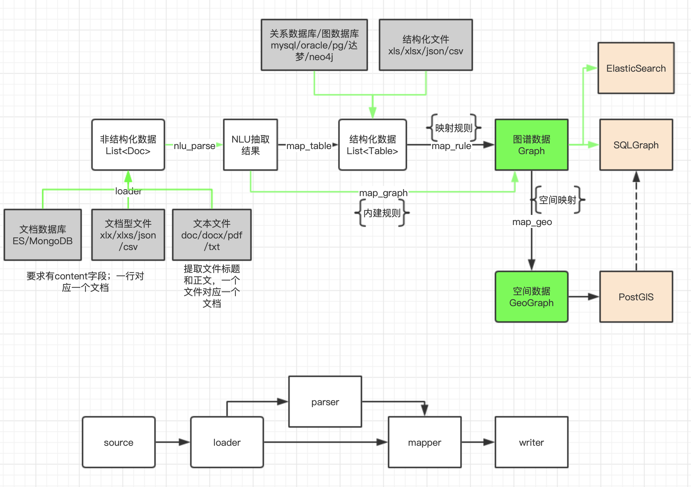

# 概述
本项目内容为GoIN底层数据接入模块代码，包含无结构化数据接入、结构化数据接入、以及半结构化数据接入！

用于从多种数据源进行数据提取、转换、构建知识图谱



## 消息队列配置
 ```
  {
     "type": "local | mongo",
     "mongo": {

     }
  }
```

## 任务配置
```
{
  "process": ["loader", "writer"],
  "loader": {
    "source": {
        "type": "file | db"
        "file": {
           "path": "filepath" | ["filepath...."],
           "allow": true
        },
        "db": {
           "type": "mysql postgres mongodb ...",
           "host": "server",
           "port": 3306
        }
    },
    "name_as_title": true,
    "add_id": true,
    "keep_all": true,
    "select": [],
    "content": ["cont", "content"]
  },
  "parser": {
    "name": "corenlu",
    "service": "http://117.160.193.19:9080/nlu_inte",
    "tasks": ["ner", "nel", "event", "keywords", "topic", "sentiment"],
    "lang": "zh",
    "parse_fields": ["content"]
  }
  "mapper": {
    "pipes": ["graph", "geo"],
    "graph": {}
  },
  "writer": {
    "targets": ["goin"],
    "goin": {
        
    }
  }
}
```

## loader
数据加载：
- 数据源
 1. 文件
  结构化文件：csv/xls/xlsx/json
  非结构化文件：doc/docx/pdf/txt
 2. 数据库
  关系数据库：mysql/postgres/oracle/达梦
  文档数据库：mongodb/elasticsearch
- 自动生成ID
- 保留字段
- 文档过滤

## Parse
文档解析（针对非结构化数据）：

nlu_parse
 - tasks: ner nel event sentiments keywords 
 
## mapper
数据转换（针对结构化数据）
1. map_graph
2. map_geo
3. map_goin_graph
4. map_rm_docfields

## writer
数据输出
1. console 控制台输出，直接打印
2. file 文件输出
3. goin 输出到goin系统
